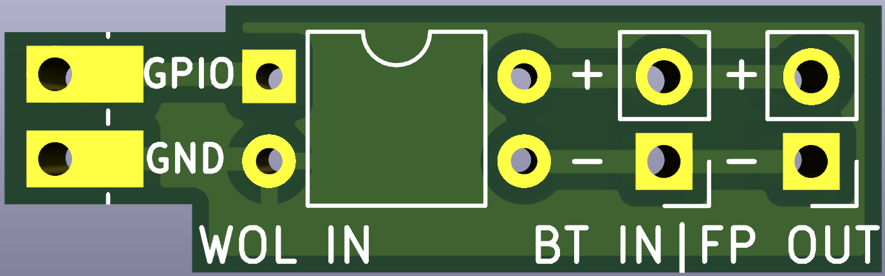

# Turn on your pc useing a raspberry pico-w

## Main goal of the project

Some motherboards dosent support wol or just dosent always work,
but useing a pico as the wol reciver (the pico connects to wifi) you could turn on your pc from anywhere in the world if you use port forwarding on your router.

## Thecnical side

### main.c

In `#define` setup your `SSID` `PASSWORD` and your `GPIO_PIN` number has to be configured and then build the firmweare.

#### Building the firmweare

```
cd code
cmake .
make
```

### The pico and motherboard

When the pico recives a magic packet it send a signal to the optocoupler (the pico cannot be on the same ground as your pc) and briges the power button and turns on the pc. But thers a pass truh port that you plug in your existing pc's power button so the pc's power button dosent lose it's function. And the pc can be turn on by existing button and by the pcio.

`Wol in`: pico gpio input
`BT in`: pc case power button
`FP out`: front panel out

## Motherboard pics


